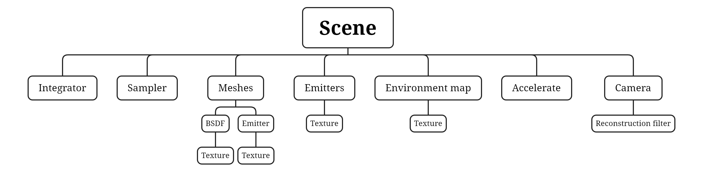
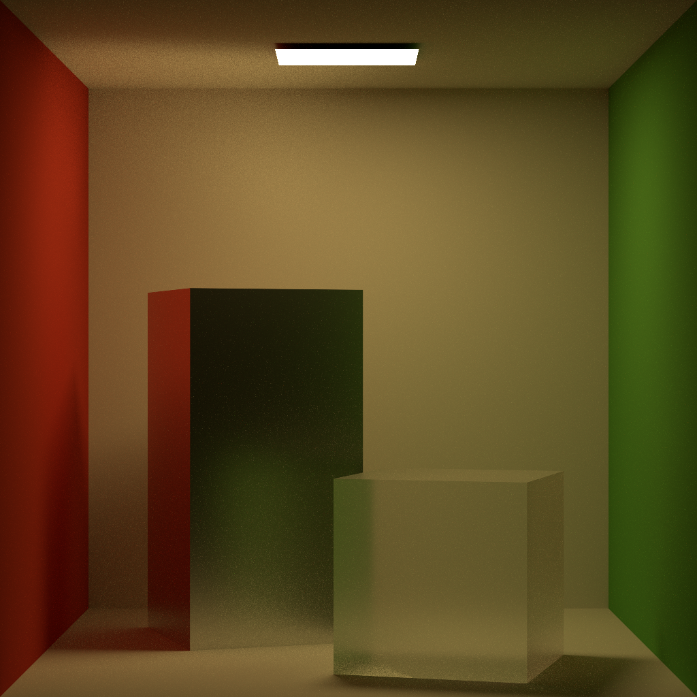
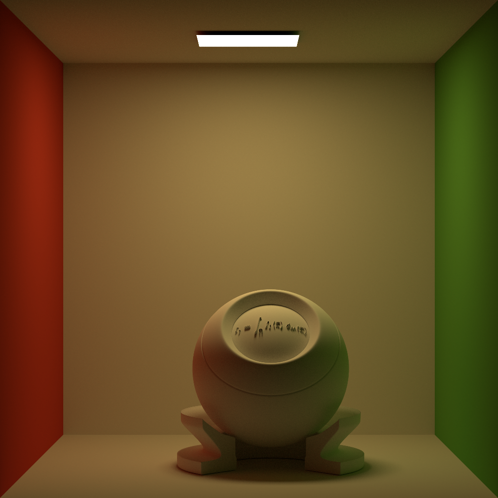
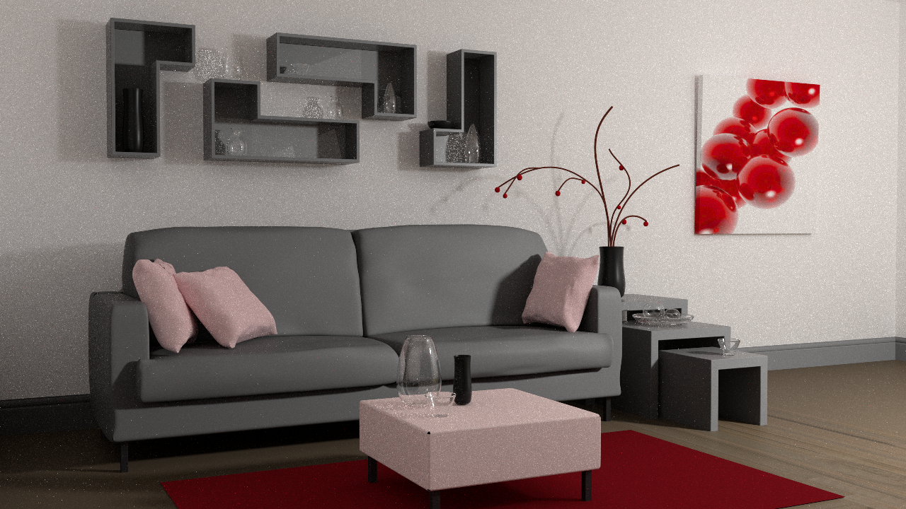
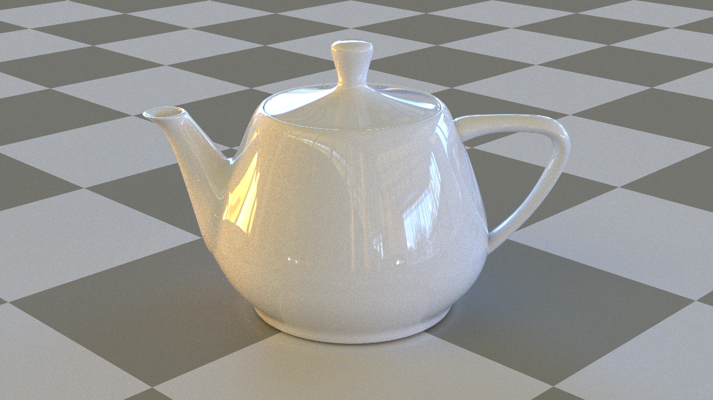
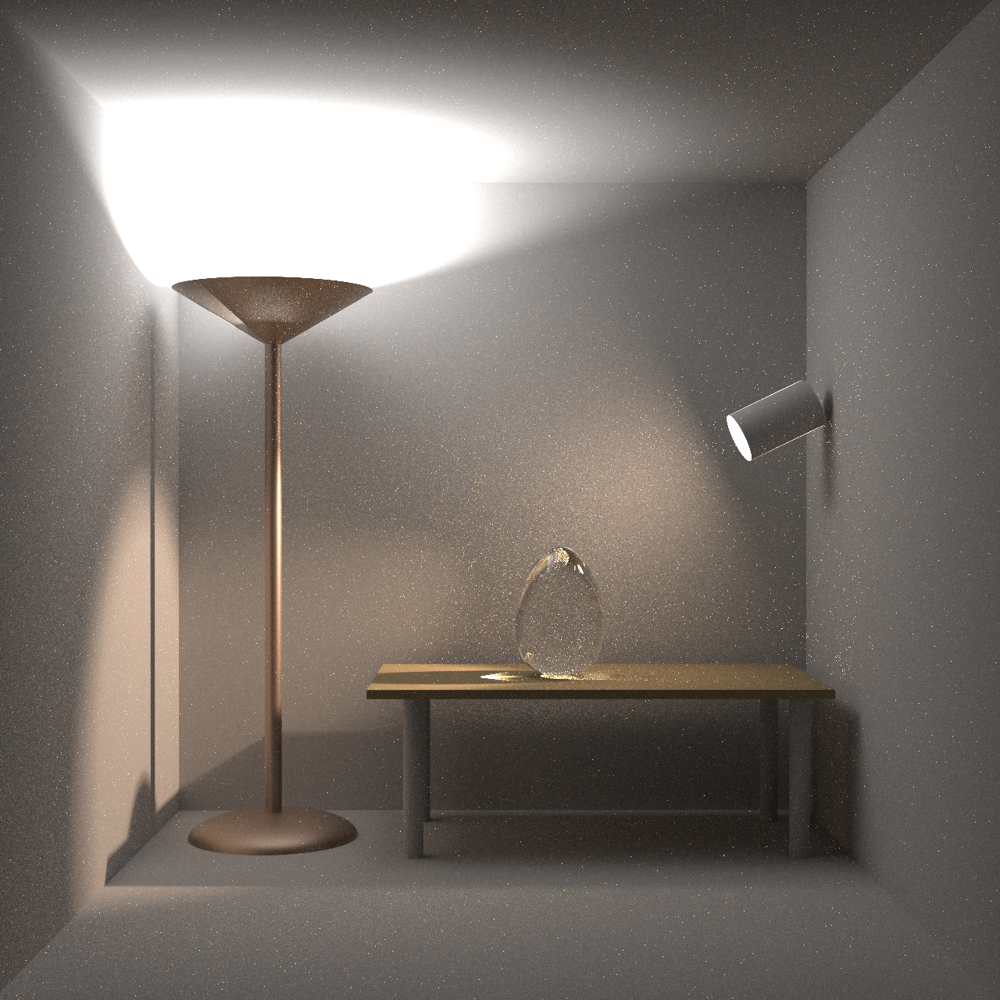

# Tiny Renderer


## Introduction

This is a path-tracing renderer implemented in C++, designed to adhere to the [PBRT](https://pbr-book.org/3ed-2018/contents) standard and support multi-threaded rendering. The project structure is inspired by [Mitsuba 3](http://www.mitsuba-renderer.org/).

The renderer takes an XML file describing the scene as input and generates an image, which is saved to the specified path.

- Acceleration Structures
    - Supports Bounding Volume Hierarchy (BVH), KD-Trees (KDTree), and Octrees for accelerating ray intersection.
- Material Support
    - Basic Materials: Diffuse, Conductor, Dielectric, Plastic, Thin Dielectric, Rough Conductor, Rough Dielectric, Rough Plastic.
    - Special Materials: Mask, Bump Map, Two-Sided Material.
    - Texture Support: Anisotropic Textures (exr, hdr, png, jpeg, etc.), Constant Texture, Checkerboard Texture.
- Lighting Models
    - Supports any number of area lights as well as skybox lighting.
- Geometry
    - Supports meshes defined by OBJ files.
    - Built-in Geometry: Cube, Rectangle, Sphere.
- Path Tracing
    - Uses Multiple Importance Sampling (MIS) to sample both materials and lights within the scene.


## Building and Running

### Windows 11

Compiler: Visual Studio 2022

Navigate to the project root directory and run the following commands in cmd:

```cmd
mkdir build
cd build
cmake .. -G "Visual Studio 17 2022"
cmake --build . --config Release
```

The executable will be generated in `build/src/Release`. Run the executable:

```cmd
tiny-renderer.exe 'xml relative path of the root directory' -t 'thread count'
```

The rendered image (png) will be generated in the same directory as the XML file.

### MacOS

Compiler: Xcode. Ensure that CMake and Xcode command-line tools are installed on your system.

Navigate to the project root directory and run the following commands in the terminal:

```bash
mkdir build
cd build
cmake .. -G "Xcode"
xcodebuild -configuration Release
```

The executable will be generated in `build/src/Release`. Run the executable:

```bash
tiny-renderer 'xml relative path of the root directory' -t 'thread count'
```

The rendered image (png) will be generated in the same directory as the XML file.

### Linux

Compiler: g++.

Navigate to the project root directory and run the following commands in the terminal:

```bash
cmake -DCMAKE_BUILD_TYPE=Release -S . -B build
cd build
make -j${proc}
```

The executable will be generated in `build/src/`. Run the executable:

```bash
tiny-renderer 'xml relative path of the root directory' -t 'thread count'
```

The rendered image (png) will be generated in the same directory as the XML file.


## Code Structure

### Basic Data Types

Basic data types are located in `include/core`, primarily template classes that define fundamental data structures and implement a basic math library. These include:

- **pcg32**: Random number generation.
- **array**: Arrays, including vectors, points, and normals, which are distinguished during linear transformations.
- **matrix**: Matrix class, including operations such as multiplication, inversion, and transposition.
- **bounding box**: Bounding box class, including operations like detection, expansion, merging, and ray intersection.
- **distribution**: Models one-dimensional and two-dimensional probability densities, implementing sampling, probability calculation, and reparameterization.
- **frame**: Used for transforming between world and local coordinates.
- **fresnel**: Computes Fresnel terms for conductors and dielectrics.
- **microfacet**: Models microsurfaces, including normal distribution and geometric occlusion terms.
- **intersection**: Data structure for ray-surface intersections.
- **quad**: Implements Legendre integration for subsurface scattering in plastic materials.
- **ray**: Ray class.
- **record**: Class for storing sampling data.
- **spectrum**: Color class, currently only implementing RGB, not spectra.
- **tensor**: Large tensor with dynamic storage allocation, used for material storage.
- **timer**: Timing class.
- **transform**: Transformation class, including transformations for vectors, points, normals, and the construction of perspective projection, rotation, and translation matrices.
- **warp**: A series of random number distribution transformation functions.

### Scene Composition

Classes that can be instantiated via XML files are referred to as components and are located in `include/components`. These describe scene components and wrap tools needed for path tracing. All classes inherit from the base class `Object` and are registered with the `ObjectFactory` class to instantiate component classes and establish containment relationships when reading XML files. Below is the containment diagram of component classes:



Except for environment lighting (`Environment map`), all other lights (`Emitter`) are attached to geometry (`Mesh`). However, the `Scene` retains shared pointers to all lights for management and importance sampling with multiple lights.


## Multiple Importance Sampling Algorithm

### Introduction

Path tracing primarily relies on recursive sampling to compute the rendering equation. The rendering equation can be expressed as:
$$
L_o(p,\omega_o)=L_e(p,\omega_o)+\int_\Omega f_r(p,\omega_i,\omega_o)L_i(p,\omega_i)|\cos\theta_i|\mathrm{d}\omega_i
$$
Path tracing uses Monte Carlo integration to sample light paths and compute the integral. For the integral $\displaystyle\int f(x)\mathrm{d}\mu(x)$, samples $x_1\cdots x_n$ are taken from the probability distribution $X\sim p(x)$ in the integration space, and the integral result is approximated via the formula $\displaystyle{\frac{1}{n}\sum_{i=1}^n\frac{f(x_i)}{p(x_i)}}$. The variance of this integral computation is: $\displaystyle{\frac{1}{n}\left[\int\frac{f(x)^2}{p(x)}\mathrm{d}\mu(x)-(\displaystyle\int f(x)\mathrm{d}\mu(x))^2\right]}$. Therefore, the closer $p(x)$ is to the normalized $f(x)$, the smaller the variance of $p(x)$.

However, it is difficult to obtain an analytical solution for $f(x)$. In this case, there are two sampling strategies: one is to sample based on the BSDF, and the other is to sample based on the light distribution. A common approach is to separate diffuse reflection and light sampling:
$$
\begin{align}
L_o(p,\omega_o)
& =L_e(p,\omega_o)+\int_\Omega f_r(p,\omega_i,\omega_o)L_i(p,\omega_i)|\cos\theta_i|\mathrm{d}\omega_i\\
& =L_e(p,\omega_o)+\int_\Omega f_r(p,\omega_i,\omega_o)(L_e(p',\omega_i)+L_o(p'',\omega_i))|\cos\theta_i|\mathrm{d}\omega_i\\
& =L_e(p,\omega_o)+\int_\Omega f_r(p,\omega_i,\omega_o)L_e(p',\omega_i)|\cos\theta_i|\mathrm{d}\omega_i+\\&\int_\Omega f_r(p,\omega_i,\omega_o)L_o(p'',\omega_i)|\cos\theta_i|\mathrm{d}\omega_i\\
\end{align}
$$
However, this approach makes it impossible for specular materials to sample light sources, as the specular reflection distribution is a $\delta$ distribution, making the integral a $\delta$ distribution integral. Since light sources have a certain area, it is difficult to sample precisely at the $\delta$ distribution point, resulting in a BSDF sampling probability density of $0$.

Multiple Importance Sampling (MIS) combines multiple sampling methods, sampling different parts of the integrand and combining these samples to achieve results close to optimal sampling. In MIS, to fit the result of the integral $\displaystyle\int f(x)\mathrm{d}\mu(x)$, we use $m$ sampling strategies, each sampling $n_i$ times. The MIS formula can be expressed as:
$$
\begin{align}
& \sum_{i=1}^m\frac{1}{n_i}\sum_{j=1}^{n_i}w_i(x_{i,j})\frac{f(x_{i,j})}{p_i(x_{i,j})}\\
& \text{where }w_i(x_{i,j})=\frac{(n_ip_i(x_{i,j}))^\beta}{\sum_j^m (n_ip_i(x_{i,j}))^\beta}
\end{align}
$$
Thus, for the integral $\displaystyle{\int f_r(p,\omega_i,\omega_o)L_e(p',\omega_i)|\cos\theta_i|\mathrm{d}\omega_i}$, it can be sampled with probability $p$ using BSDF and with probability $1-p$ using light source sampling, greatly alleviating this issue. Multiple Importance Sampling can be expressed as:
$$
\begin{align}
& L_o(p,\omega_o)=L_e(p,\omega_o)+\hat{L_s}(p,\omega_o)\\
& \hat{L_s}(p,\omega_o)=\left\{
\begin{array}{cl}
& \hat{L_{s1}}(p,\omega_o)=\frac{f_r(p,\omega_i,\omega_o)L_i(p,\omega_i)|\cos\theta_i|}{p(\omega_i)}\text{ if $f_r$ is specular at p}\\
& \hat{L_{s2}}(p,\omega_o)=\hat{E}(p,\omega_o)+\hat{S}(p,\omega_o)\text{ otherwise}
\end{array}
\right.\\
& \hat{E}(p,\omega_o)=\frac{\hat{E_I}(p,\omega_o)}{p_I(I)}\text{ for } I\in\{1, 2\} \text{ sampled by pdf } p_I\\
& \hat{E_1}(p,\omega_o)=\frac{f_r(p,\omega_i,\omega_o)L_e(p',\omega_i)|\cos\theta_i|}{p_{emitter}(\omega_i)}\\
& \hat{E_2}(p,\omega_o)=\frac{f_r(p,\omega_i,\omega_o)L_e(p',\omega_i)|\cos\theta_i|}{p_{bsdf}(\omega_i)}\\
& \hat{S}(p,\omega_o)=\hat{E_2}(p,\omega_o)=\frac{f_r(p,\omega_i,\omega_o)L_o(p'',\omega_i)|\cos\theta_i|}{p_{bsdf}(\omega_i)}\\
\end{align}
$$

### Main Loop Implementation

The implementation is located in the `li` function in `src/integrator/path.cpp`, with the following process:

1. **Ray Initialization**: A ray is emitted from the camera along the view direction, intersecting with the scene for the first time and recording the intersection information.

   ```cpp
   SurfaceIntersection3f its;
   bool is_intersect = scene->get_accel()->ray_intersect(ray, its, false);
   ```

   `its` records various information about the intersection, including:

   ```cpp
   PointType p;  // Intersection point
   Scalar t;  // Ray travel distance
   NormalType n;  // Normal, interpolated if normals exist; otherwise, computed as the cross product of triangle edges
   PointType2 uv;  // UV coordinates, interpolated if UVs exist; otherwise, derived from barycentric coordinates
   FrameType shading_frame;  // Normal frame interpolated from normals
   FrameType geometric_frame;  // Triangle normal frame
   VectorType wi;  // Incident ray in local coordinates
   VectorType dp_du;  // Rate of change of p with respect to u, used for bump mapping
   VectorType dp_dv;  // Rate of change of p with respect to v, used for bump mapping
   uint32_t primitive_index;  // Triangle ID
   std::shared_ptr<Mesh> mesh;  // Shared pointer to the corresponding mesh
   ```

2. **Direct Lighting Contribution**:

   ```cpp
   // ---------------------- Direct emission ----------------------
 
   // If intersect an emitter
   if (is_intersect && (!its.mesh || its.mesh->is_emitter())) {
       DirectionSample3f ds(its, prev_si);
       if (!its.mesh) {
           ds.emitter = scene->get_environment();
       }
       float em_pdf = 0.0f;
 
       if (!prev_bsdf_delta) {
           em_pdf = scene->pdf_emitter_direction(prev_si, ds, valid);
       }
 
       float mis_bsdf = mis_weight(prev_bsdf_pdf, em_pdf);
 
       result += throughput * ds.emitter->eval(its, valid) * mis_bsdf;
   }
   ```

   This corresponds to $\hat{E_2}$ in the formula and the light source part of $\hat{L_{s1}}(p,\omega_o)$.

3. **Determine Whether to Continue Bouncing**:

   ```cpp
   bool active_next = depth + 1 < m_max_depth && is_intersect && its.mesh;
 
   if (!active_next) {
   	break;
   }
   ```

   If the maximum depth is reached or there is no intersection point, the path tracing process exits.

4. **Light Source Sampling**:

   ```cpp
   std::shared_ptr<BSDF> bsdf = its.mesh->get_bsdf();
 
   // ---------------------- Emitter sampling ----------------------
   bool active_em = bsdf->has_flag(ESmooth);
 
   DirectionSample3f ds;
   Color3f em_weight;
   Vector3f wo;
 
   if (active_em) {
       std::tie(ds, em_weight) = scene->sample_emitter_direction(its, sampler->next2d(), true, active_em);
       active_em &= ds.pdf != 0.0f;
       wo = its.to_local(ds.d);
   }
   ```

   At the intersection point, a direction is selected based on the distribution of all light sources in the scene, and the sampling weight is obtained. The world coordinate direction vector is then transformed to the local coordinate system of the intersection to facilitate subsequent BSDF evaluation.

5. **BSDF Evaluation and BSDF Sampling**:

   ```cpp
   // ------ Evaluate BSDF * cos(theta) and sample direction -------
   float sample1   = sampler->next1d();
   Point2f sample2 = sampler->next2d();
 
   auto bsdf_val                   = bsdf->eval(its, wo, active_next);
   auto bsdf_pdf                   = bsdf->pdf(its, wo, active_next);
   auto [bsdf_sample, bsdf_weight] = bsdf->sample(its, sample1, sample2, active_next);
   ```

   The first two evaluate the BSDF value and corresponding probability density for directly sampling the light source, while the latter importance samples the scattering direction, BSDF value, and probability density based on the BSDF distribution.

6. **Multiple Importance Sampling (MIS) Integration**:

   ```cpp
   // --------------- Emitter sampling contribution ----------------
   if (active_em) {
       float mis_em = ds.delta ? 1.0f : mis_weight(ds.pdf, bsdf_pdf);
       result += throughput * bsdf_val * em_weight * mis_em;
   }
   ```

   This corresponds to the light source part of $\hat{E_1}$ in the formula.

7. **BSDF Sampling to Obtain New Direction and Update Throughput**:

   ```cpp
   // ---------------------- BSDF sampling ----------------------
   ray = its.spawn_ray(its.to_world(bsdf_sample.wo));
 
   // ------ Update loop variables based on current interaction ------
   throughput *= bsdf_weight;
   eta *= bsdf_sample.eta;
   valid_ray |= valid && its.is_valid();
 
   // Information about the current vertex needed by the next iteration
   prev_si         = its;
   prev_bsdf_pdf   = bsdf_sample.pdf;
   prev_bsdf_delta = bsdf_sample.delta;
   ```

   This corresponds to $\hat{S}$ and the scattering part of $\hat{L_{s1}}(p,\omega_o)$ in the formula, accumulating through loop sampling.

8. **Russian Roulette**:

   ```cpp
   // -------------------- Stopping criterion ---------------------
   depth += 1;
   float throughput_max = throughput.max_value();
   float rr_prob        = M_MIN(throughput_max * eta * eta, 0.95f);
   bool rr_active       = depth >= m_rr_depth;
   bool rr_continue     = sampler->next1d() < rr_prob;
    
   if (rr_active) {
   	throughput *= 1.0f / rr_prob;
   }
    
   valid = (!rr_active || rr_continue) && throughput_max != 0.0f;
   ```

   Russian Roulette is used to randomly truncate paths with very low energy when the path is long enough, avoiding infinite recursion and meaningless computations while ensuring unbiased results. Specifically, it is enabled when `depth >= m_rr_depth` (e.g., after the 5th or 6th bounce); a continuation probability `rr_prob = min(throughput_max * eta^2, 0.95)` is calculated, and if the random number `sampler->next1d()` is less than `rr_prob`, the path continues; otherwise, it terminates. If it continues, `throughput` is multiplied by `1 / rr_prob` to compensate for the expected drop caused by this random process, ensuring the final result remains unbiased.

### Active Sampling Strategy for Light Sources

In the case of multiple light sources in a scene, a polygonal light source is first randomly sampled with a uniform distribution. On the polygonal light source, the product of the triangle area and the average luminance of the triangle's three vertices is used as the probability density function for importance sampling, thus importance sampling the light sources in the scene. The specific implementation can be found in the `sample_emitter_direction` function in `scene.cpp` and the implementation in `area.cpp`.


## Results













## Future Updates

1. Volume Rendering: Scattering Media, Phase Functions, and Corresponding Path Tracers.
2. More Integrators: Bidirectional Path Tracing, Metropolis Light Transport.
3. More Materials: Normal Maps, BSSRDF ([Position-Free Monte Carlo Simulation for Arbitrary Layered BSDFs](https://shuangz.com/projects/layered-sa18/)), Hair, etc.
4. More Types of Geometry: Implementation of Curves and Surfaces.
5. Interactive GUI.
6. Ray Tracing Denoising.


## Known Issues

1. Image resolution not being a power of two causes errors when saving the image.
2. Misidentification of the `Smooth` tag in layered materials.