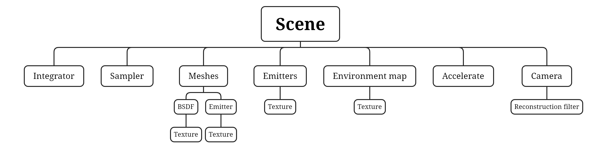
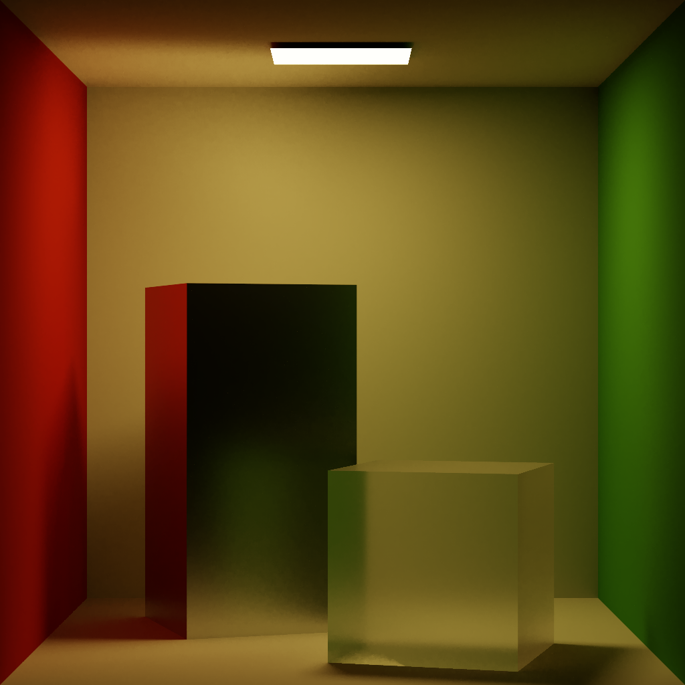
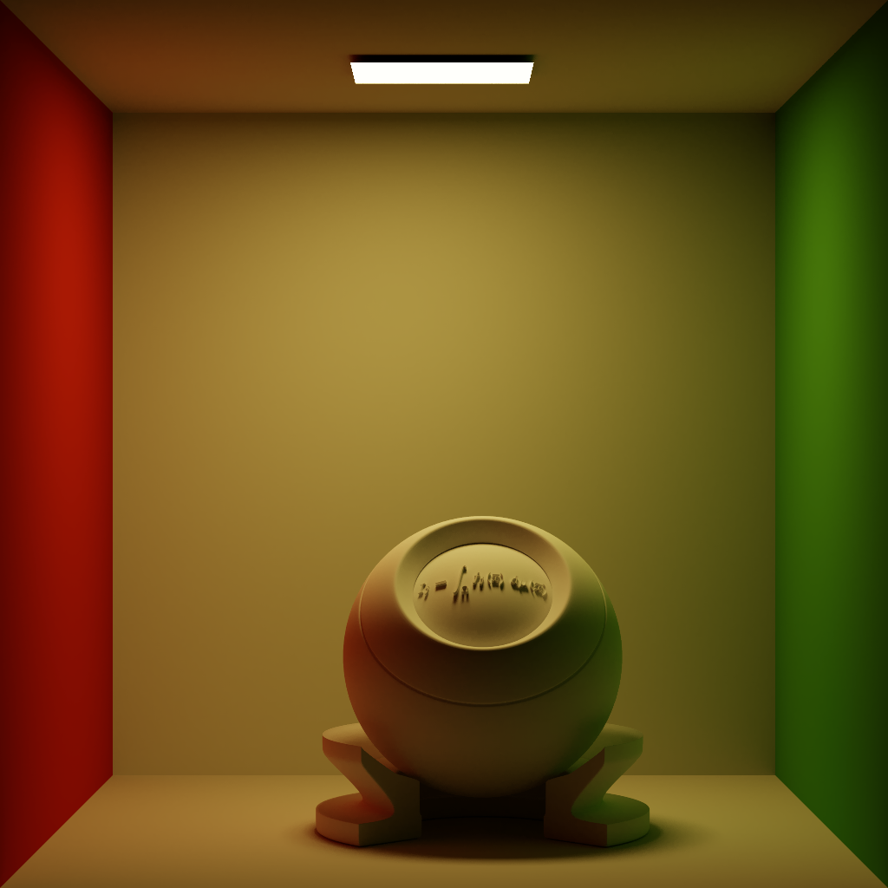
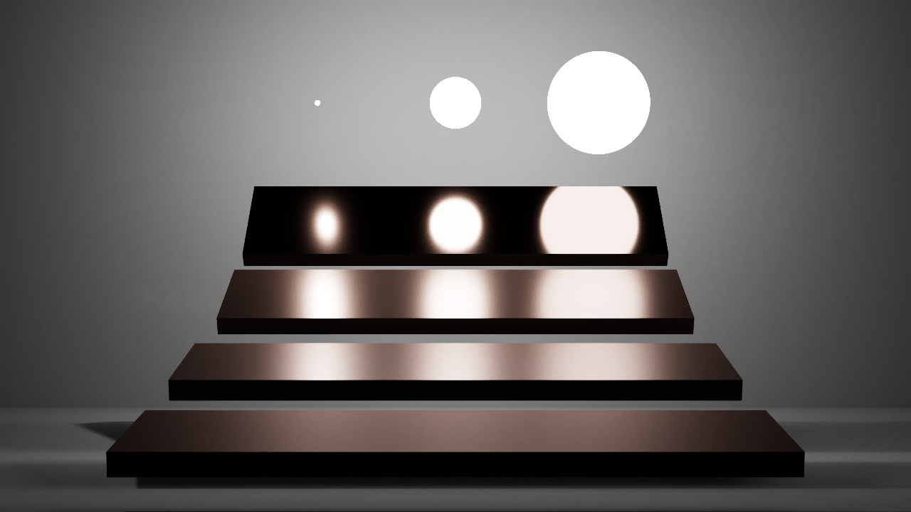
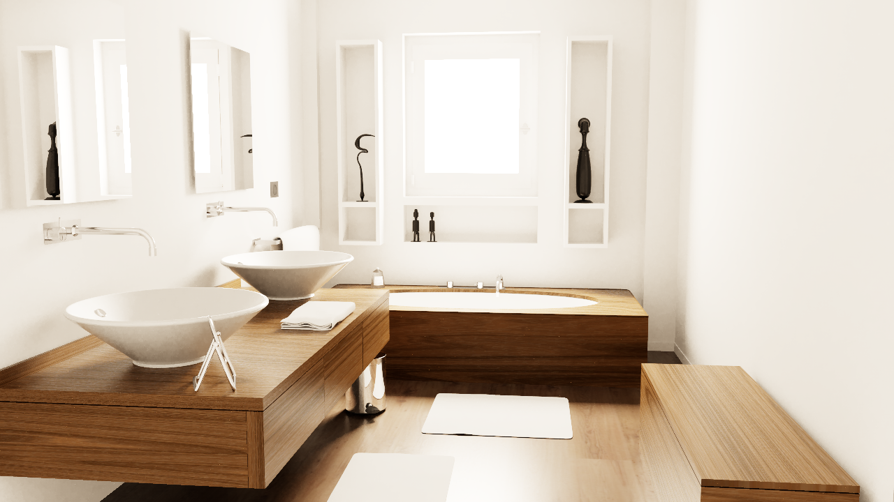
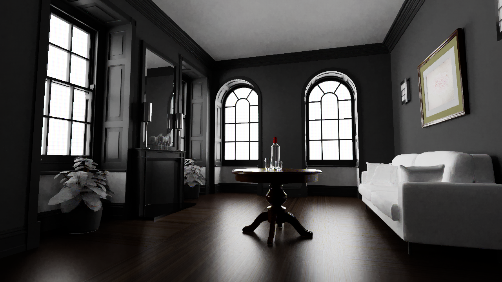
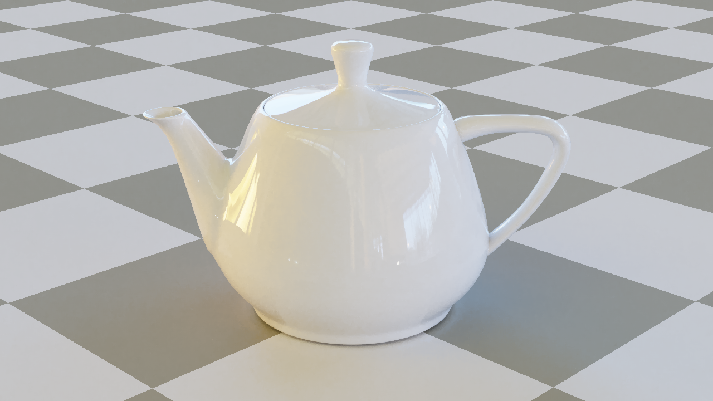
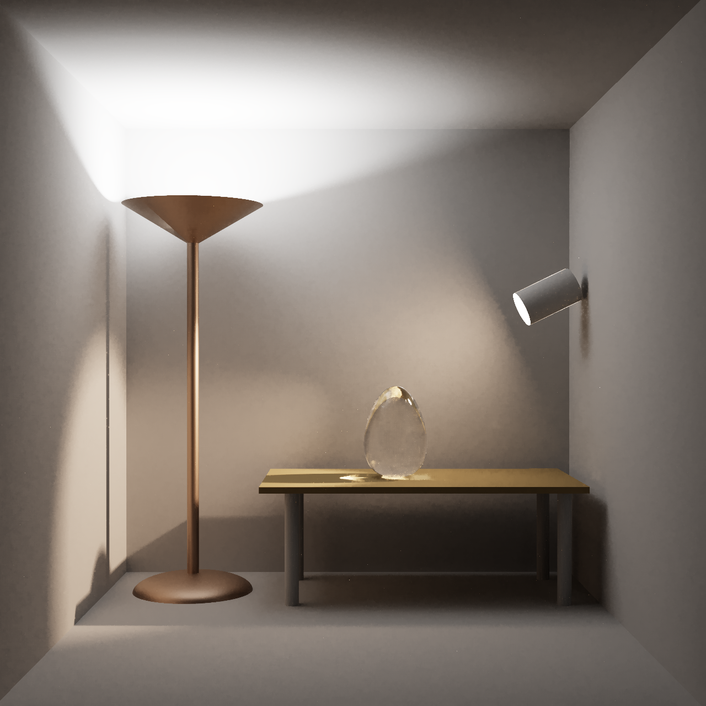
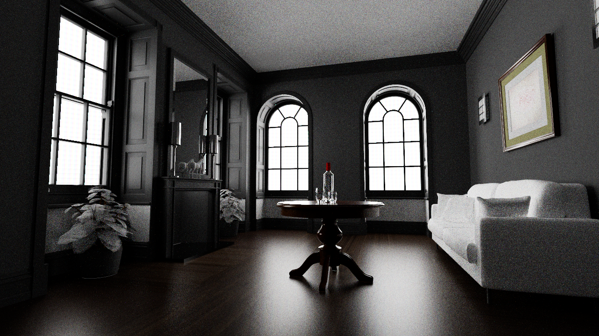
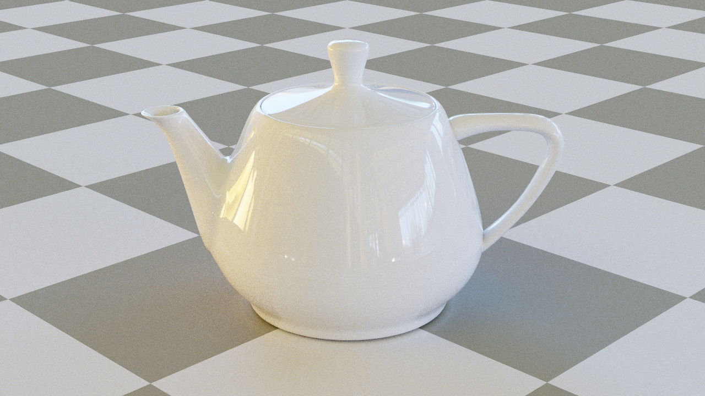

# Tiny Renderer


## Introduction

This is a path-tracing renderer implemented in C++, designed to adhere to the [PBRT](https://pbr-book.org/3ed-2018/contents) standard and support multi-threaded rendering. The project structure is inspired by [Mitsuba 3](http://www.mitsuba-renderer.org/).

The renderer takes an XML file describing the scene as input and generates an image, which is saved to the specified path.

- Acceleration Structures
    - Supports Bounding Volume Hierarchy (BVH), KD-Trees (KDTree), and Octrees for accelerating ray intersection.
- Material Support
    - Basic Materials: Diffuse, Conductor, Dielectric, Plastic, Thin Dielectric, Rough Conductor, Rough Dielectric, Rough Plastic.
    - Special Materials: Mask, Bump Map, Two-Sided Material.
    - Texture Support: Anisotropic Textures (exr, hdr, png, jpeg, etc.), Constant Texture, Checkerboard Texture.
- Lighting Models
    - Supports any number of area lights as well as skybox lighting.
- Geometry
    - Supports meshes defined by OBJ files.
    - Built-in Geometry: Cube, Rectangle, Sphere.
- Path Tracing
    - Uses Multiple Importance Sampling (MIS) to sample both materials and lights within the scene.
- Denoising
    - Single-frame Monte Carlo denoisers: `atrous` (edge-avoiding À-Trous wavelet), `nlm` (non-local means) and `outlier` (firefly rejection).
    - Configured from the scene XML, and nestable: a denoiser may take one child denoiser as a pre-filter (typically `outlier` before `atrous`).
    - Runs on linear radiance before tonemapping, so the same implementation serves both the CPU and the GPU render paths.
- GPU Backend (experimental)
    - A Vulkan compute path tracer with two backends: **Megakernel** (one dispatch per spp, full bounce loop in-shader) and **Wavefront** (6 kernels per bounce connected by compacted work queues).
    - Shaders are written in [Slang](https://shader-slang.org/) and cross-compiled to SPIR-V.
- Real-Time Interactive Mode
    - A persistent GPU session rendering 1 spp per frame with SVGF spatiotemporal filtering, an orbit/fly camera and an ImGui settings panel. See [Interactive Mode](#interactive-mode).


## Building and Running

### Prerequisites

| Dependency | Required? | Used for |
| --- | --- | --- |
| CMake >= 3.19 and a C++17 compiler | Required | Everything |
| [Vulkan SDK](https://vulkan.lunarg.com/) (including `slangc` on `PATH`) | Optional | GPU backend (`--gpu`) and interactive mode (`--interactive`) |
| [GLFW 3](https://www.glfw.org/) + OpenGL | Optional | Preview window (`--progress`) and interactive mode |

Third-party libraries (`pugixml`, `stb`, `tinyexr`, Dear ImGui, GLFW) are vendored under `ext/` as git submodules and need no installation (clone with `--recursive`, or run `git submodule update --init --recursive`).

Note that "optional" is not the same as "safe to skip": `M_ENABLE_GPU` defaults to `ON`, so a default build *does* require the Vulkan SDK and `slangc`. GLFW is the only one CMake can silently do without - and even then, on Windows/Apple it builds the bundled `ext/glfw` from source. Linux still needs the system package (GLFW's X11/Wayland backends need dev headers), so only there does a missing GLFW mean building without a window.

Install the optional dependencies with the system package manager, e.g.:

```bash
# macOS
brew install glfw            # preview window / interactive mode
# then install the LunarG Vulkan SDK (provides Vulkan + slangc) from https://vulkan.lunarg.com/

# Ubuntu / Debian
sudo apt install libglfw3-dev
# then install the LunarG Vulkan SDK

# Windows: install the Vulkan SDK (provides Vulkan + slangc); GLFW needs nothing, it is built from ext/glfw
```

### CMake Options

| Option | Default | Effect |
| --- | --- | --- |
| `M_ENABLE_GPU` | `ON` | Builds the Vulkan GPU backend and links it into `tiny-renderer`. Requires the Vulkan SDK and `slangc`; **if either is missing, configure fails** (`find_package(Vulkan REQUIRED)` / `find_program(slangc REQUIRED)`). Set `-DM_ENABLE_GPU=OFF` to build CPU-only. |
| `M_ENABLE_PREVIEW_GUI` | `ON` | Builds the GLFW + Dear ImGui windows. If `glfw3`/OpenGL are **not** found, CMake prints a status message and silently continues without them - `--progress` then only prints a console bar, and `--interactive` is unavailable. On Windows/Apple this rarely happens: when no system `glfw3` is found, the bundled `ext/glfw` is compiled from source instead. |

For example, a minimal CPU-only build with no windowing:

```bash
cmake -DCMAKE_BUILD_TYPE=Release -DM_ENABLE_GPU=OFF -DM_ENABLE_PREVIEW_GUI=OFF -S . -B build
```

### Windows 11

Compiler: Visual Studio 2022

Navigate to the project root directory and run the following commands in cmd:

```cmd
mkdir build
cd build
cmake .. -G "Visual Studio 17 2022"
cmake --build . --config Release
```

The executable will be generated in `build/src/Release`. Run the executable:

```cmd
tiny-renderer.exe 'xml relative path of the root directory' -t 'thread count'
```

The rendered image (png) will be generated in the same directory as the XML file.

### MacOS

Compiler: Xcode. Ensure that CMake and Xcode command-line tools are installed on your system.

Navigate to the project root directory and run the following commands in the terminal:

```bash
mkdir build
cd build
cmake .. -G "Xcode"
xcodebuild -configuration Release
```

The executable will be generated in `build/src/Release`. Run the executable:

```bash
tiny-renderer 'xml relative path of the root directory' -t 'thread count'
```

The rendered image (png) will be generated in the same directory as the XML file.

### Linux

Compiler: g++.

Navigate to the project root directory and run the following commands in the terminal:

```bash
cmake -DCMAKE_BUILD_TYPE=Release -S . -B build
cd build
make -j${proc}
```

The executable will be generated in `build/src/`. Run the executable:

```bash
tiny-renderer 'xml relative path of the root directory' -t 'thread count'
```

The rendered image (png) will be generated in the same directory as the XML file.

### Command-line Reference

```
tiny-renderer <scene.xml> [options]
```

| Option | Description |
| --- | --- |
| `<scene.xml>` | Required. Its parent directory is added to the file resolver, so the XML can reference OBJ files and textures with relative paths. |
| `-t N` / `--threads N` | Number of CPU render threads (default 1). Ignored by `--gpu` and `--interactive`. |
| `--gpu[=megakernel\|wavefront]` | Render on the GPU instead of the CPU. Backend defaults to `megakernel`. |
| `--progress` | Print a live console progress bar (percentage / elapsed / ETA) and, when the preview GUI was built, open a window showing the image so far. |
| `--tonemap=none\|aces` | Tone mapping applied when writing the PNG (default `none`). |
| `--denoise[=outlier\|atrous\|nlm]` | Install a denoiser with its default parameters, overriding the scene's `<denoiser>` block. `--denoise` alone selects `atrous`. |
| `--dump-aov` | Also write the denoiser's input buffers as PNGs, for parameter tuning. |
| `--interactive[=WxH]` | Open the real-time interactive window. `WxH` overrides the scene's output resolution (default: the resolution configured in the XML). |

`--interactive` takes precedence over `--gpu`; interactive mode does **not** write any PNG, it only displays the result (close the window to exit).

#### Output files

For `assets/teapot/teapot.xml`, output is written next to the scene file:

| File | Written when |
| --- | --- |
| `teapot.png` | Always - the final image (filtered, if a denoiser is active) |
| `teapot_noisy.png` | Whenever a denoiser ran - the unfiltered render, kept for A/B comparison |
| `teapot_albedo.png`, `teapot_normal.png`, `teapot_variance.png` | Only with `--dump-aov` |

#### Examples

```bash
# CPU rendering with 8 threads
tiny-renderer assets/teapot/teapot.xml -t 8

# GPU megakernel with a live preview window
tiny-renderer assets/dragon/dragon.xml --gpu=megakernel --progress

# GPU wavefront, denoised and ACES-tonemapped, dumping the denoiser inputs
tiny-renderer assets/box/box.xml --gpu=wavefront --denoise=atrous --tonemap=aces --dump-aov

# Real-time interactive window at 1280x720
tiny-renderer assets/dragon/dragon.xml --interactive=1280x720
```


## Interactive Mode

`--interactive` replaces the offline "render once and write a PNG" flow with a **persistent GPU session**: each frame dispatches `spp_per_frame` samples, and SVGF (temporal reprojection + À-Trous spatial filtering) turns that 1 spp signal into a progressively converging image. The result is blitted straight from the GPU's RGBA8 buffer, so the host does zero per-pixel work per frame.

### Requirements

Interactive mode is compiled in only when **both** are true (see [CMake Options](#cmake-options)):

- `M_ENABLE_GPU=ON` (Vulkan SDK + `slangc`), and
- `M_ENABLE_PREVIEW_GUI=ON` **and** `glfw3` + OpenGL were found at configure time (on Windows/Apple a missing system `glfw3` is covered by the bundled `ext/glfw`).

Otherwise the flag prints `This build lacks interactive support ...` and exits. When configuring, watch for the CMake line `M_ENABLE_PREVIEW_GUI is ON but glfw3/OpenGL were not found` - that is the silent-degradation case.

### Controls

| Input | Orbit mode (default) | Fly mode |
| --- | --- | --- |
| Left drag | Orbit around the target | - |
| Middle / right drag | Pan | Pan |
| Wheel | Dolly (zoom) | Move forward / back |
| `W` `A` `S` `D` | - | Move along the view axes |
| `Q` / `E` | - | Move down / up |
| `Shift` | - | 4x sprint |

The initial view and FOV are read from the scene XML, so the session opens exactly where the scene said the camera should be. Any camera or render-setting change resets the temporal history (the accumulation is stale for the new view); display-only settings do not.

### Panel

The ImGui panel (top-left) exposes:

- **Stats**: FPS / frame time, accumulated spp, and the per-pass GPU timing breakdown (`path_trace`, `temporal`, `atrous`, `display`).
- **Camera**: Orbit / Fly, FOV, move speed, reset view.
- **Render**: spp per frame (1-8), max depth, Russian-roulette depth, radiance clamp (0 disables), albedo demodulation, reset accumulation.
- **Denoise**: temporal filter toggles and rejection thresholds (`alpha`, `phi_depth`, `phi_normal`, history clamping, growth), plus the spatial pass (iterations, `phi_color`, `phi_normal`, `phi_depth`). Setting iterations to 0 isolates what the temporal pass alone delivers.
- **Display**: exposure, tonemap (Clamp / Reinhard / ACES), sRGB transfer, gamma, and **debug views** (raw illum, filtered illum, albedo, normal, depth, variance, history length, position) - the debug views are how the filter gets tuned.

### Automating a run

Set `M_INTERACTIVE_MAX_FRAMES=N` to stop after N frames and print the average FPS. Without it the loop runs until the window closes, which makes frame-rate comparisons depend on when that happens.

```bash
M_INTERACTIVE_MAX_FRAMES=300 tiny-renderer assets/dragon/dragon.xml --interactive=1280x720
```


## GPU Backend

The GPU path (`--gpu`, `--interactive`) reuses the same `Scene`/`BVH` construction as the CPU renderer, flattens it into plain arrays (`Scene::build_gpu_scene()`, see `include/core/gpu_scene.h`), uploads it once, and runs the path tracer as Vulkan compute shaders written in Slang (`src/gpu/shaders`) and cross-compiled to SPIR-V at build time.

- **Megakernel** (`--gpu=megakernel`): one dispatch per spp, the whole bounce loop inside a single shader.
- **Wavefront** (`--gpu=wavefront`): the same algorithm split into 6 kernels per bounce (raygen / extend / shade / shadow + indirect-dispatch housekeeping), connected by persistent per-pixel state and compacted work queues.

BVH traversal is done in-shader rather than through `VK_KHR_ray_query`, because MoltenVK (used on macOS) does not implement hardware ray tracing.

### Limitations

- Only the `bvh` acceleration structure exports the flat BVH the GPU needs; other `accelerate` types fail with a `std::runtime_error`.
- Denoiser feature buffers (albedo / normal / depth) are recomputed on the CPU with one primary ray per pixel (`compute_gbuffer`), while the variance estimate comes from the GPU's half-buffer accumulation - so GPU renders feed the denoisers the same information the CPU path does.
- Interactive mode currently displays only; there is no "save the current view back to the XML" button (the camera matrix is available via `CameraController::to_string()`).

### Standalone GPU tools

Built alongside `tiny-renderer` when `M_ENABLE_GPU=ON` (`build/src/gpu/` for single-config generators, `build/src/gpu/Release` for Visual Studio / Xcode):

| Executable | Purpose |
| --- | --- |
| `gpu-smoketest` | Minimal Vulkan compute smoke test (no scene) |
| `gpu-raytrace-debug <scene.xml> [output.png]` | BVH traversal / normal visualization |
| `gpu-path-trace <scene.xml> [output.png] [spp]` | Offline megakernel path tracer |
| `gpu-wavefront <scene.xml> [output.png] [spp]` | Offline wavefront path tracer |
| `gpu-interactive-verify <scene.xml> [spp]` | Asserts that N interactive frames equal N spp of the offline megakernel, and that the temporal filter converges |
| `atomic-test` | Device atomic diagnostics (no scene) |


## Scene File Format

A scene is an XML document whose root is `<scene>`. The sampler, acceleration structure, integrator, camera and (optionally) denoiser are declared once; meshes and emitters follow.

```xml
<scene>
    <sampler type="independent">
        <integer name="sample_count" value="1024"/>
    </sampler>

    <accelerate type="bvh">
        <integer name="leaf_max" value="5"/>
        <integer name="max_depth" value="100"/>
    </accelerate>

    <integrator type="path">
        <integer name="max_depth" value="5"/>
        <integer name="rr_depth" value="5"/>
    </integrator>

    <camera type="perspective">
        <rfilter type="tent">
            <float name="radius" value="0.5"/>
        </rfilter>
        <transform name="to_world">
            <matrix value="1 0 0 0 0 1 0 0 0 0 1 0 0 0 0 1"/>
        </transform>
        <float name="fov" value="35"/>
        <integer name="width" value="1280"/>
        <integer name="height" value="720"/>
    </camera>

    <mesh type="obj">
        <string name="filename" value="models/Mesh001.obj"/>
        <bsdf type="diffuse">
            <texture type="constant">
                <color name="color" value="0.9, 0.9, 0.9"/>
            </texture>
        </bsdf>
    </mesh>

    <emitter type="envmap">
        <texture type="bitmap">
            <string name="filename" value="textures/envmap.hdr"/>
        </texture>
    </emitter>
</scene>
```

See `assets/` for complete scenes (`teapot.xml` is the smallest one).

### Denoisers

A `<denoiser>` element is a child of `<scene>` and is used whenever the render finishes (CPU or GPU). It may contain one nested denoiser, which runs first as a pre-filter - the canonical combination being firefly rejection before the spatial filter:

```xml
<denoiser type="atrous">
    <integer name="iterations" value="5"/>
    <float name="sigma_c" value="4.0"/>
    <denoiser type="outlier"/>
</denoiser>
```

Parameters (defaults in parentheses):

| Type | Parameters |
| --- | --- |
| `atrous` | `iterations` (5), `sigma_c` (4.0, colour), `sigma_n` (128.0, normal), `sigma_d` (1.0, depth), `sigma_a` (0.05, albedo), `demodulate` (true), `threads` (0) |
| `nlm` | `radius` (10), `patch_radius` (3), `k` (0.45), `k_smooth` (1.0), `alpha` (1.0), `cross_validate` (true), `demodulate` (true), `sigma_n` (0.8), `sigma_d` (0.6), `threads` (0) |
| `outlier` | `radius` (1), `threshold` (2.0), `threads` (0) |

`threads = 0` means "use `std::thread::hardware_concurrency()`".


## Code Structure

### Basic Data Types

Basic data types are located in `include/core`, primarily template classes that define fundamental data structures and implement a basic math library. These include:

- **pcg32**: Random number generation.
- **array**: Arrays, including vectors, points, and normals, which are distinguished during linear transformations.
- **matrix**: Matrix class, including operations such as multiplication, inversion, and transposition.
- **bounding box**: Bounding box class, including operations like detection, expansion, merging, and ray intersection.
- **distribution**: Models one-dimensional and two-dimensional probability densities, implementing sampling, probability calculation, and reparameterization.
- **frame**: Used for transforming between world and local coordinates.
- **fresnel**: Computes Fresnel terms for conductors and dielectrics.
- **microfacet**: Models microsurfaces, including normal distribution and geometric occlusion terms.
- **intersection**: Data structure for ray-surface intersections.
- **quad**: Implements Legendre integration for subsurface scattering in plastic materials.
- **ray**: Ray class.
- **record**: Class for storing sampling data.
- **spectrum**: Color class, currently only implementing RGB, not spectra.
- **tensor**: Large tensor with dynamic storage allocation, used for material storage.
- **timer**: Timing class.
- **transform**: Transformation class, including transformations for vectors, points, normals, and the construction of perspective projection, rotation, and translation matrices.
- **warp**: A series of random number distribution transformation functions.
- **gpu_scene**: The flattened, GPU-uploadable form of a `Scene` - plain arrays of vertices, triangles, BVH nodes, materials, textures and lights, produced by `Scene::build_gpu_scene()`.

### Scene Composition

Classes that can be instantiated via XML files are referred to as components and are located in `include/components`. These describe scene components and wrap tools needed for path tracing. All classes inherit from the base class `Object` and are registered with the `ObjectFactory` class to instantiate component classes and establish containment relationships when reading XML files. Below is the containment diagram of component classes:



Except for environment lighting (`Environment map`), all other lights (`Emitter`) are attached to geometry (`Mesh`). However, the `Scene` retains shared pointers to all lights for management and importance sampling with multiple lights.

### Rendering Utilities (`include/render`)

- **block**: `ImageBlock` (per-thread accumulation buffer, optionally carrying AOV half-buffers) and `BlockGenerator` (the work scheduler that hands blocks to threads).
- **aov**: The auxiliary sample record (`albedo` / `normal` / `depth`) stored alongside radiance when a denoiser asks for it.
- **framebuffer**: `FrameBufferSet` - the bundle of colour / half-buffer / variance / feature buffers that flows from a render into a denoiser.
- **gbuffer**: Recomputes the geometric feature buffers (albedo, normal, depth) on the CPU with one primary ray per pixel, so GPU renders can be denoised with the same information as CPU renders.
- **progress**: `ProgressReporter` - `--progress`'s console bar plus the optional preview window.
- **denoise_utils**: Shared helpers (buffer conversion, parallel band scheduling) used by the denoisers.

### Denoisers (`include/components/denoiser.h`, `src/denoisers`)

`Denoiser` is an `Object` subclass, so it is instantiated straight from the XML through the same `ObjectFactory` as every other component. It consumes a finished render in linear radiance space and returns a filtered image in the same space; it may hold one nested denoiser as a pre-filter. Implementations: `atrous`, `nlm`, `outlier`.

### GPU Backend (`include/gpu`, `src/gpu`)

- **vk_context**: Vulkan instance / device / queue setup and shader-module loading.
- **gpu_buffer**, **gpu_image**: Buffer and storage-image wrappers (the denoiser's screen-sized buffers are images, not buffers).
- **gpu_scene_upload**: Packs a `GPUScene` into the device buffers the shaders bind.
- **gpu_renderer**: Offline GPU entry points (`render_gpu`, `render_gpu_with_aov`) used by `--gpu`.
- **gpu_session**: `InteractiveSession` - the persistent session behind `--interactive`; hoists all one-time setup into the constructor so `render_frame()` is cheap enough to call 30+ times a second.
- **gpu_timings**: Per-pass GPU timestamp queries shown in the interactive panel.
- **src/gpu/shaders**: Slang sources (`path_trace`, `wavefront_*`, `rt_path_trace`, `svgf_*`) cross-compiled to SPIR-V into the build directory.

### GUI (`include/gui`, `src/gui`)

- **preview_window**: The passive window used by `--progress` - it displays an image handed to it and owns no loop.
- **interactive_window**: The window that *owns* the interactive loop: it captures input, hosts the ImGui settings panel, blits the GPU's RGBA8 output, and reports when a change invalidates the temporal accumulation.
- **camera_controller**: Input-agnostic camera kinematics (orbit / pan / dolly / fly) that outputs ready-to-upload `camera_to_world` and `sample_to_camera` matrices. It deliberately does not touch `Camera`, keeping GLFW state out of the offline renderer.


## Multiple Importance Sampling Algorithm

### Introduction

Path tracing primarily relies on recursive sampling to compute the rendering equation. The rendering equation can be expressed as:
$$
L_o(p,\omega_o)=L_e(p,\omega_o)+\int_\Omega f_r(p,\omega_i,\omega_o)L_i(p,\omega_i)|\cos\theta_i|\mathrm{d}\omega_i
$$
Path tracing uses Monte Carlo integration to sample light paths and compute the integral. For the integral $\displaystyle\int f(x)\mathrm{d}\mu(x)$, samples $x_1\cdots x_n$ are taken from the probability distribution $X\sim p(x)$ in the integration space, and the integral result is approximated via the formula $\displaystyle{\frac{1}{n}\sum_{i=1}^n\frac{f(x_i)}{p(x_i)}}$. The variance of this integral computation is: $\displaystyle{\frac{1}{n}\left[\int\frac{f(x)^2}{p(x)}\mathrm{d}\mu(x)-(\displaystyle\int f(x)\mathrm{d}\mu(x))^2\right]}$. Therefore, the closer $p(x)$ is to the normalized $f(x)$, the smaller the variance of $p(x)$.

However, it is difficult to obtain an analytical solution for $f(x)$. In this case, there are two sampling strategies: one is to sample based on the BSDF, and the other is to sample based on the light distribution. A common approach is to separate diffuse reflection and light sampling:
$$
\begin{align}
L_o(p,\omega_o)
& =L_e(p,\omega_o)+\int_\Omega f_r(p,\omega_i,\omega_o)L_i(p,\omega_i)|\cos\theta_i|\mathrm{d}\omega_i\\
& =L_e(p,\omega_o)+\int_\Omega f_r(p,\omega_i,\omega_o)(L_e(p',\omega_i)+L_o(p'',\omega_i))|\cos\theta_i|\mathrm{d}\omega_i\\
& =L_e(p,\omega_o)+\int_\Omega f_r(p,\omega_i,\omega_o)L_e(p',\omega_i)|\cos\theta_i|\mathrm{d}\omega_i+\\&\int_\Omega f_r(p,\omega_i,\omega_o)L_o(p'',\omega_i)|\cos\theta_i|\mathrm{d}\omega_i\\
\end{align}
$$
However, this approach makes it impossible for specular materials to sample light sources, as the specular reflection distribution is a $\delta$ distribution, making the integral a $\delta$ distribution integral. Since light sources have a certain area, it is difficult to sample precisely at the $\delta$ distribution point, resulting in a BSDF sampling probability density of $0$.

Multiple Importance Sampling (MIS) combines multiple sampling methods, sampling different parts of the integrand and combining these samples to achieve results close to optimal sampling. In MIS, to fit the result of the integral $\displaystyle\int f(x)\mathrm{d}\mu(x)$, we use $m$ sampling strategies, each sampling $n_i$ times. The MIS formula can be expressed as:
$$
\begin{align}
& \sum_{i=1}^m\frac{1}{n_i}\sum_{j=1}^{n_i}w_i(x_{i,j})\frac{f(x_{i,j})}{p_i(x_{i,j})}\\
& \text{where }w_i(x_{i,j})=\frac{(n_ip_i(x_{i,j}))^\beta}{\sum_{k=1}^m (n_kp_k(x_{i,j}))^\beta}
\end{align}
$$
Thus, for the integral $\displaystyle{\int f_r(p,\omega_i,\omega_o)L_e(p',\omega_i)|\cos\theta_i|\mathrm{d}\omega_i}$, it can be sampled with probability $p$ using BSDF and with probability $1-p$ using light source sampling, greatly alleviating this issue. Multiple Importance Sampling can be expressed as:
$$
\begin{align}
& L_o(p,\omega_o)=L_e(p,\omega_o)+\hat{L_s}(p,\omega_o)\\
& \hat{L_s}(p,\omega_o)=\left\{
\begin{array}{cl}
& \hat{L_{s1}}(p,\omega_o)=\frac{f_r(p,\omega_i,\omega_o)L_i(p,\omega_i)|\cos\theta_i|}{p(\omega_i)}\text{ if $f_r$ is specular at p}\\
& \hat{L_{s2}}(p,\omega_o)=\hat{E}(p,\omega_o)+\hat{S}(p,\omega_o)\text{ otherwise}
\end{array}
\right.\\
& \hat{E}(p,\omega_o)=w_1\,\hat{E_1}(p,\omega_o)+w_2\,\hat{E_2}(p,\omega_o)\\
& w_1=\frac{p_{emitter}^2(\omega_i)}{p_{emitter}^2(\omega_i)+p_{bsdf}^2(\omega_i)},\quad w_2=\frac{p_{bsdf}^2(\omega_i)}{p_{emitter}^2(\omega_i)+p_{bsdf}^2(\omega_i)}\\
& \hat{E_1}(p,\omega_o)=\frac{f_r(p,\omega_i,\omega_o)L_e(p',\omega_i)|\cos\theta_i|}{p_{emitter}(\omega_i)}\\
& \hat{E_2}(p,\omega_o)=\frac{f_r(p,\omega_i,\omega_o)L_e(p',\omega_i)|\cos\theta_i|}{p_{bsdf}(\omega_i)}\\
& \hat{S}(p,\omega_o)=\frac{f_r(p,\omega_i,\omega_o)L_o(p'',\omega_i)|\cos\theta_i|}{p_{bsdf}(\omega_i)}\\
\end{align}
$$

### Main Loop Implementation

The implementation is located in the `li` function in `src/integrator/path.cpp`, with the following process:

1. **Ray Initialization**: A ray is emitted from the camera along the view direction, intersecting with the scene for the first time and recording the intersection information.

   ```cpp
   SurfaceIntersection3f its;
   bool is_intersect = scene->get_accel()->ray_intersect(ray, its, false);
   ```

   `its` records various information about the intersection, including:

   ```cpp
   PointType p;  // Intersection point
   Scalar t;  // Ray travel distance
   NormalType n;  // Normal, interpolated if normals exist; otherwise, computed as the cross product of triangle edges
   PointType2 uv;  // UV coordinates, interpolated if UVs exist; otherwise, derived from barycentric coordinates
   FrameType shading_frame;  // Normal frame interpolated from normals
   FrameType geometric_frame;  // Triangle normal frame
   VectorType wi;  // Incident ray in local coordinates
   VectorType dp_du;  // Rate of change of p with respect to u, used for bump mapping
   VectorType dp_dv;  // Rate of change of p with respect to v, used for bump mapping
   uint32_t primitive_index;  // Triangle ID
   std::shared_ptr<Mesh> mesh;  // Shared pointer to the corresponding mesh
   ```

2. **Direct Lighting Contribution**:

   ```cpp
   // ---------------------- Direct emission ----------------------
 
   // If intersect an emitter
   if (is_intersect && (!its.mesh || its.mesh->is_emitter())) {
       DirectionSample3f ds(its, prev_si);
       if (!its.mesh) {
           ds.emitter = scene->get_environment();
       }
       float em_pdf = 0.0f;
 
       if (!prev_bsdf_delta) {
           em_pdf = scene->pdf_emitter_direction(prev_si, ds, valid);
       }
 
       float mis_bsdf = mis_weight(prev_bsdf_pdf, em_pdf);
 
       result += throughput * ds.emitter->eval(its, valid) * mis_bsdf;
   }
   ```

   This corresponds to $\hat{E_2}$ in the formula and the light source part of $\hat{L_{s1}}(p,\omega_o)$.

3. **Determine Whether to Continue Bouncing**:

   ```cpp
   bool active_next = depth + 1 < m_max_depth && is_intersect && its.mesh;
 
   if (!active_next) {
   	break;
   }
   ```

   If the maximum depth is reached or there is no intersection point, the path tracing process exits.

4. **Light Source Sampling**:

   ```cpp
   std::shared_ptr<BSDF> bsdf = its.mesh->get_bsdf();
 
   // ---------------------- Emitter sampling ----------------------
   bool active_em = bsdf->has_flag(ESmooth);
 
   DirectionSample3f ds;
   Color3f em_weight;
   Vector3f wo;
 
   if (active_em) {
       std::tie(ds, em_weight) = scene->sample_emitter_direction(its, sampler->next2d(), true, active_em);
       active_em &= ds.pdf != 0.0f;
       wo = its.to_local(ds.d);
   }
   ```

   At the intersection point, a direction is selected based on the distribution of all light sources in the scene, and the sampling weight is obtained. The world coordinate direction vector is then transformed to the local coordinate system of the intersection to facilitate subsequent BSDF evaluation.

5. **BSDF Evaluation and BSDF Sampling**:

   ```cpp
   // ------ Evaluate BSDF * cos(theta) and sample direction -------
   float sample1   = sampler->next1d();
   Point2f sample2 = sampler->next2d();
 
   auto bsdf_val                   = bsdf->eval(its, wo, active_next);
   auto bsdf_pdf                   = bsdf->pdf(its, wo, active_next);
   auto [bsdf_sample, bsdf_weight] = bsdf->sample(its, sample1, sample2, active_next);
   ```

   The first two evaluate the BSDF value and corresponding probability density for directly sampling the light source, while the latter importance samples the scattering direction, BSDF value, and probability density based on the BSDF distribution.

6. **Multiple Importance Sampling (MIS) Integration**:

   ```cpp
   // --------------- Emitter sampling contribution ----------------
   if (active_em) {
       float mis_em = ds.delta ? 1.0f : mis_weight(ds.pdf, bsdf_pdf);
       result += throughput * bsdf_val * em_weight * mis_em;
   }
   ```

   This corresponds to the light source part of $\hat{E_1}$ in the formula.

7. **BSDF Sampling to Obtain New Direction and Update Throughput**:

   ```cpp
   // ---------------------- BSDF sampling ----------------------
   ray = its.spawn_ray(its.to_world(bsdf_sample.wo));
 
   // ------ Update loop variables based on current interaction ------
   throughput *= bsdf_weight;
   eta *= bsdf_sample.eta;
   valid_ray |= valid && its.is_valid();
 
   // Information about the current vertex needed by the next iteration
   prev_si         = its;
   prev_bsdf_pdf   = bsdf_sample.pdf;
   prev_bsdf_delta = bsdf_sample.delta;
   ```

   This corresponds to $\hat{S}$ and the scattering part of $\hat{L_{s1}}(p,\omega_o)$ in the formula, accumulating through loop sampling.

8. **Russian Roulette**:

   ```cpp
   // -------------------- Stopping criterion ---------------------
   depth += 1;
   float throughput_max = throughput.max_value();
   float rr_prob        = M_MIN(throughput_max * eta * eta, 0.95f);
   bool rr_active       = depth >= m_rr_depth;
   bool rr_continue     = sampler->next1d() < rr_prob;
    
   if (rr_active) {
   	throughput *= 1.0f / rr_prob;
   }
    
   valid = (!rr_active || rr_continue) && throughput_max != 0.0f;
   ```

   Russian Roulette is used to randomly truncate paths with very low energy when the path is long enough, avoiding infinite recursion and meaningless computations while ensuring unbiased results. Specifically, it is enabled when `depth >= m_rr_depth` (e.g., after the 5th or 6th bounce); a continuation probability `rr_prob = min(throughput_max * eta^2, 0.95)` is calculated, and if the random number `sampler->next1d()` is less than `rr_prob`, the path continues; otherwise, it terminates. If it continues, `throughput` is multiplied by `1 / rr_prob` to compensate for the expected drop caused by this random process, ensuring the final result remains unbiased.

### Active Sampling Strategy for Light Sources

In the case of multiple light sources in a scene, a polygonal light source is first randomly sampled with a uniform distribution. On the polygonal light source, the product of the triangle area and the average luminance of the triangle's three vertices is used as the probability density function for importance sampling, thus importance sampling the light sources in the scene. The specific implementation can be found in the `sample_emitter_direction` function in `scene.cpp` and the implementation in `area.cpp`.


## Results















### Denoising

Each scene directory also holds the unfiltered render (`*_noisy.png`), written automatically whenever a denoiser runs, so the filter's effect can be judged by A/B-ing the pair:

| Unfiltered (`*_noisy.png`) | Denoised (`*.png`) |
| --- | --- |
|  |  |
|  |  |
|  |  |


## Future Updates

1. Volume Rendering: Scattering Media, Phase Functions, and Corresponding Path Tracers.
2. More Integrators: Bidirectional Path Tracing, Metropolis Light Transport.
3. More Materials: Normal Maps, BSSRDF ([Position-Free Monte Carlo Simulation for Arbitrary Layered BSDFs](https://shuangz.com/projects/layered-sa18/)), Hair, etc.
4. More Types of Geometry: Implementation of Curves and Surfaces.
5. ~~Interactive GUI.~~ Done - `--interactive`, see [Interactive Mode](#interactive-mode).
6. ~~Ray Tracing Denoising.~~ Done - `atrous` / `nlm` / `outlier` denoisers offline, and SVGF in interactive mode.
7. GPU backend: hardware ray tracing (`VK_KHR_ray_query`) where available, and full material/volume parity with the CPU path.
8. Saving a camera pose found interactively back into the scene XML.


## Known Issues

1. Image resolution not being a power of two causes errors when saving the image. (Historical: `Bitmap::save_png()` now writes through `stbi_write_png`, which imposes no power-of-two constraint - this may no longer reproduce, and needs re-verification.)
2. Misidentification of the `Smooth` tag in layered materials.
3. `--interactive` is unavailable when the build lacks the GPU backend or the preview GUI; if `glfw3`/OpenGL are missing, CMake only prints a status line and continues, so the failure surfaces at run time rather than configure time (on Windows/Apple this cannot happen: the bundled `ext/glfw` is used).
4. The GPU backends only support scenes whose acceleration structure exports a flat BVH (currently only `bvh`); other types throw `std::runtime_error`.
5. `--no-gui` is still advertised in the CLI usage string but is not implemented; `--progress` is what enables the preview window.
6. Interactive mode does not write images to disk, and there is no button yet to copy the current camera pose back into the XML.
